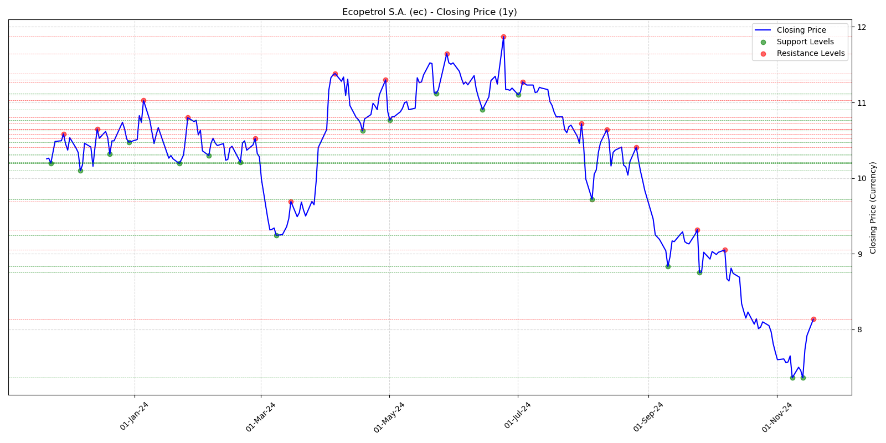

# Stock_Lens
Stock Data Analysis and Visualization Tools: This repository contains a Python-based toolkit for analyzing stock data and generating insightful visualizations. Key features include

# Stock Data Analysis Tool

Welcome to the Stock Data Analysis Tool, codename Stock_Lens, repository! This project provides a comprehensive Python-based framework for analyzing stock market data. It offers a modular design, enabling detailed insights into various stock-related metrics and trends.

## Features

- **Historical Data Retrieval**: Fetch stock data using the `yfinance` library.
- **Customizable Timeframes**: Analyze data for custom periods (`e.g., 3m, 5y, ytd`).
- **Graphical Analysis**:
  - Candlestick charts with volume overlays.
  - RSI (Relative Strength Index) visualization.
  - Support and resistance level identification.
  - Trading volume correlation with price movement.
- **Modular Design**:
  - Separate modules for graph generation, time axis control, and data parsing.
- **Built for Long-Term Investment Insights**: Ideal for investors seeking to identify trends and opportunities in the stock market.

## Examples


## Installation

1. Clone the repository:
   ```bash
   git clone https://github.com/your-username/stock-data-analysis-tool.git

## Requirements
- yfinance
- matplotlib
- numpy
- datetime
- matplotlib.dates
- colorama
- scipy
- mplfinance
- matplotlib
 
## Contributing
Contributions are welcome! Feel free to open issues or submit pull requests to enhance the tool. Ensure your code adheres to the PEP 8 standard and includes relevant documentation.
